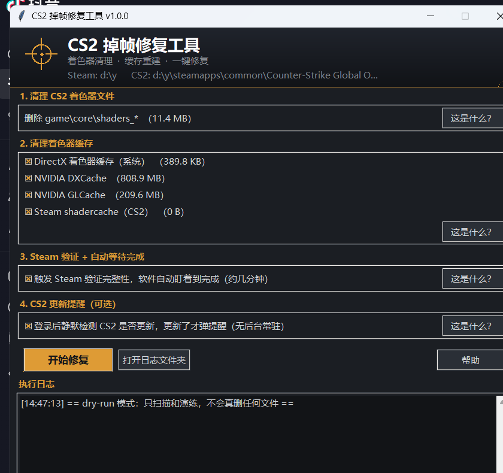

# CS2 Shader Fixer · CS2 掉帧修复工具

[English](#english) | [中文](#中文)

---

<a id="english"></a>
## English

One-click fix for CS2 stutter / FPS drops after major updates, based on the well-known community fix: delete stale shader VPKs → let Steam verify & redownload → clear driver/system shader caches. All manual steps from the forum post, automated — you click twice, the tool does the rest and waits for Steam to finish.



### What it does

| Module | What it actually does |
|---|---|
| 1. Clean CS2 shader files | Deletes the 4 official pre-compiled shader VPKs in `game\core\` (~12 MB) |
| 2. Clear shader caches | Windows `D3DSCache`, NVIDIA `DXCache` / `GLCache` / `PerDriverVersion\DXCache`, AMD `DxCache` / `GLCache` / `VkCache`, Steam `shadercache\730` — only shown if they exist |
| 3. Steam verify + auto-wait | Triggers `steam://validate/730`, then polls Steam's log + the deleted files every 3 s until Steam finishes redownloading them |
| 4. Update reminder (optional) | A per-user logon entry silently compares CS2's buildid for ~2 s at logon. Only pops a notification when CS2 actually updated. No background process. |

### Why fully automatic is safe

- The restore is done **by Steam itself** (file verification), independent of this tool — if the tool crashes, loses power, or is closed midway, Steam still finishes the job.
- Right after deleting, the tool writes a "pending restore" list (`%LOCALAPPDATA%\CS2Fixer\pending_restore.json`). If interrupted, next launch detects it and offers one-click repair.
- If it ever gives up waiting (30 min timeout), manual path: Steam → right-click CS2 → Properties → Installed Files → Verify integrity.

### FAQ

**Why isn't `shader_build 730` included?**
That command belongs to Steam's Vulkan/Fossilize shader pipeline (Steam Deck / Linux / Proton). On Windows it effectively does nothing — it only creates empty cache directories (see [ValveSoftware/steam-for-linux#7252](https://github.com/ValveSoftware/steam-for-linux/issues/7252)), and the Steam-side cache for CS2 stays empty. Deleting the official shader VPKs + verifying + clearing driver caches is what actually fixes the stutter.

**Antivirus flags the exe?**
It's a plain PyInstaller bundle; false positives happen with all PyInstaller apps. Build it yourself from source if you prefer. Scan results and the SHA256 of each release are listed on the Release page.

**Does it touch system settings?**
No. No admin rights needed, no services, no scheduled tasks, no Steam settings changed. The only optional persistent item is the update reminder (a single `HKCU\...\Run` value), removable by unchecking one box.

### Download

Grab `CS2Fixer.exe` from the [Releases](../../releases) page.
SHA256 of v1.0.1:

```
992A9F3BE5199E4318DF4297FF39F75F06ECD153B3C0D3847280FB09102F647C
```

> v1.0.0 fixed a crash: the "pending restore" list was written from a wrong data
> shape, so the tool aborted right before triggering the Steam verification
> (`ValueError: too many values to unpack`). Files were still restored by Steam,
> but the automatic wait never started. Upgrade to v1.0.1.

### Build from source

Requires Python 3.10+ with tkinter and PyInstaller:

```bat
build.bat
```

---

<a id="中文"></a>
## 中文

CS2 大版本更新后爆卡、掉帧的一键修复工具。基于社区广为流传的修复方法：删掉过期的官方着色器包 → 让 Steam 验证并重新下载 → 清掉显卡/系统层着色器缓存。把帖子里的全部手动步骤自动化——你只需要点两次鼠标，其余全自动，并且会一直等到 Steam 补完文件。

### 功能模块

| 模块 | 实际做的事 |
|---|---|
| 1. 清理 CS2 着色器文件 | 删 `game\core\` 里 4 个官方预编译着色器 VPK（约 12 MB） |
| 2. 清理着色器缓存 | 系统 `D3DSCache`、NVIDIA `DXCache`/`GLCache`/`PerDriverVersion\DXCache`、AMD `DxCache`/`GLCache`/`VkCache`、Steam `shadercache\730`——存在才显示 |
| 3. Steam 验证 + 自动等待 | 触发 `steam://validate/730`，每 3 秒轮询 Steam 日志与被删文件，Steam 补完自动提示完成 |
| 4. CS2 更新提醒（可选） | 登录时静默比对 CS2 版本号约 2 秒，只在真的更新了才弹提醒，无常驻进程 |

### 为什么全自动是安全的

- 文件恢复由 **Steam 自己完成**（验证完整性），与本工具无关——工具崩溃、断电、被关掉，Steam 都会把文件补回来。
- 删完文件的那一刻写入"待恢复清单"（`%LOCALAPPDATA%\CS2Fixer\pending_restore.json`），下次启动自动检测并弹窗一键补回。
- 等待超时（30 分钟）也不会卡死：Steam → 右键 CS2 → 属性 → 已安装文件 → 验证游戏文件的完整性，手动一次即可。

### 常见问题

**为什么不做帖子里"控制台输 shader_build 730"那步？**
这条命令属于 Steam 的 Vulkan/Fossilize 着色器管线（Steam Deck / Linux / Proton 体系），在 Windows 上不会产生任何实际效果——只会建几个空目录（见 [ValveSoftware/steam-for-linux#7252](https://github.com/ValveSoftware/steam-for-linux/issues/7252)），CS2 在 Steam 层的缓存也是空的。真正起作用的是：删官方着色器 VPK + 验证补回 + 清显卡缓存。

**杀毒软件报毒？**
这是普通 PyInstaller 打包，报毒属于 PyInstaller 应用的常见误报。介意的话请自行从源码构建。每个 Release 页面附 SHA256 校验值。

**会改系统设置吗？**
不会。无需管理员、无服务、无计划任务、不改 Steam 设置。唯一可选的持久项是"更新提醒"（一条 `HKCU\...\Run` 登录自启动值），界面上取消勾选即彻底移除。

### 下载

在 [Releases](../../releases) 页面下载 `CS2Fixer.exe`。v1.0.1 的 SHA256：

```
992A9F3BE5199E4318DF4297FF39F75F06ECD153B3C0D3847280FB09102F647C
```

> v1.0.0 有一个崩溃 bug：「待恢复清单」按错误的数据形态写入，工具会在**触发 Steam 验证之前**中断（`ValueError: too many values to unpack`）。文件仍会被 Steam 补回，但自动等待流程不会启动。请升级到 v1.0.1。

### 从源码构建

需要 Python 3.10+（含 tkinter）与 PyInstaller：

```bat
build.bat
```

---

## License / 许可证

MIT — see [LICENSE](LICENSE).

## Disclaimer / 免责声明

This tool deletes game shader cache files that Steam can restore via file verification. Use at your own risk. Not affiliated with Valve or Counter-Strike.
本工具删除的是 Steam 可通过文件验证自动恢复的着色器缓存文件，请自行斟酌使用风险。与 Valve 及 Counter-Strike 官方无关。
